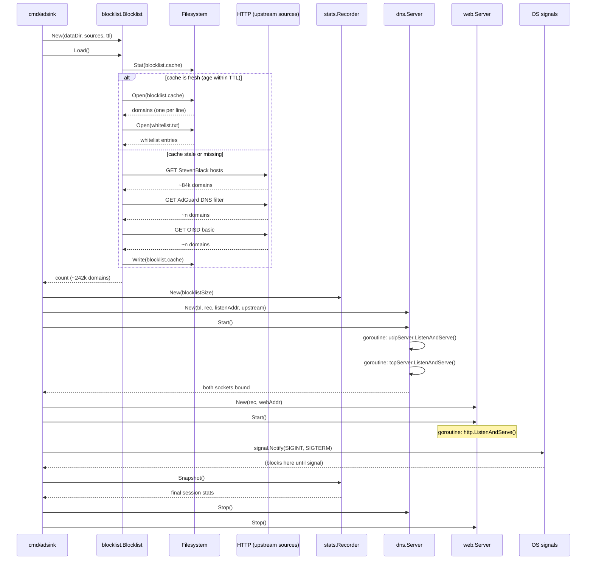
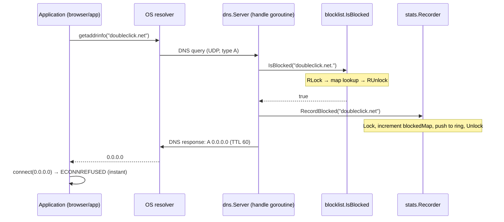
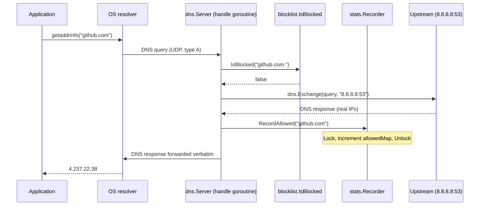
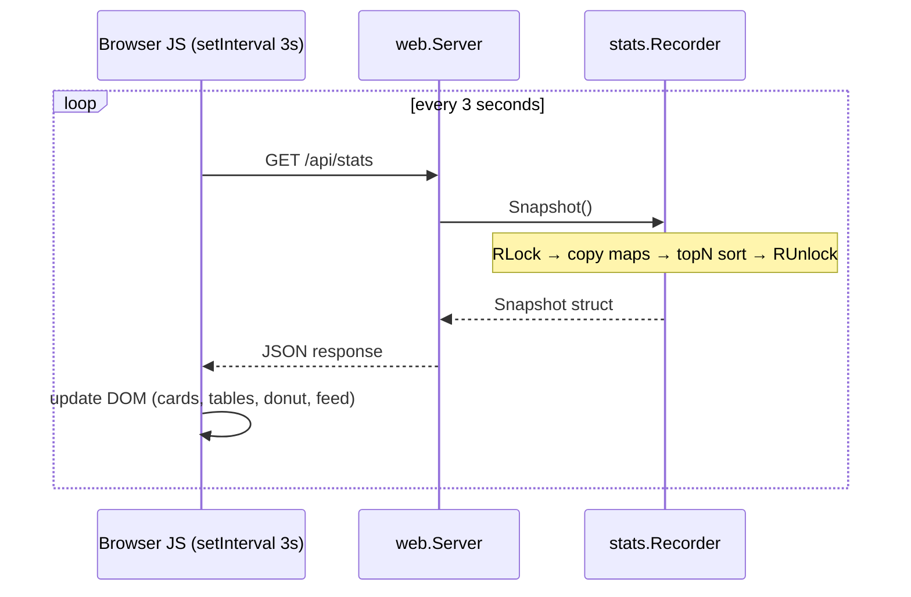

# adsink — Architecture & Design

## Overview

`adsink` is a local DNS sinkhole. Every DNS query from any application on the machine passes through it. Queries for known ad/tracker domains are answered with `0.0.0.0` (IPv4) or `::` (IPv6), so the connection is immediately refused by the caller's TCP stack. Everything else is forwarded to a real upstream resolver (default: `8.8.8.8:53`).

A built-in HTTP server serves a live statistics dashboard at `127.0.0.1:8080`.

No proxy. No TLS inspection. No kernel modules. Just DNS.

---

## High-level architecture

```
┌──────────────────────────────────────────────────────────────────────┐
│                            Linux host                                │
│                                                                      │
│  ┌──────────────┐   ┌──────────────┐   ┌──────────────────┐        │
│  │   Browser    │   │  Electron    │   │   Any process    │        │
│  │  (Chrome,    │   │    app       │   │  (curl, apt,     │        │
│  │  Firefox…)   │   │  (Spotify…)  │   │   Steam…)        │        │
│  └──────┬───────┘   └──────┬───────┘   └────────┬─────────┘        │
│         │                  │                     │                  │
│         └──────────────────┼─────────────────────┘                  │
│                            │  DNS query (UDP/TCP :53)                │
│                            ▼                                         │
│  ┌──────────────────────────────────────────────────────────────┐   │
│  │                     adsink process                        │   │
│  │                                                              │   │
│  │  ┌──────────────┐  ┌─────────────┐  ┌──────────────────┐   │   │
│  │  │  dns.Server  │  │  Blocklist  │  │  stats.Recorder  │   │   │
│  │  │  (UDP + TCP) │─▶│  (RWMutex)  │  │  (RWMutex)       │   │   │
│  │  └──────┬───────┘  └─────────────┘  └────────┬─────────┘   │   │
│  │         │ blocked → RecordBlocked()           │             │   │
│  │         │ allowed → RecordAllowed()           │             │   │
│  │         │ error   → RecordError()             │             │   │
│  │         │                          ┌──────────┘             │   │
│  │         │                          │ Snapshot()             │   │
│  │         │                          ▼                        │   │
│  │         │                 ┌─────────────────┐              │   │
│  │         │                 │   web.Server    │              │   │
│  │         │                 │  HTTP :8080     │              │   │
│  │         │                 │  GET /          │◀─── browser  │   │
│  │         │                 │  GET /api/stats │              │   │
│  │         │                 └─────────────────┘              │   │
│  │         │ not blocked                                       │   │
│  └─────────┼───────────────────────────────────────────────────┘   │
│            │                                                         │
│            │ forward query                                           │
│            ▼                                                         │
│  ┌──────────────────┐                                               │
│  │   System DNS /   │  (systemd-resolved or /etc/resolv.conf)       │
│  │   resolv.conf    │                                               │
│  └──────────────────┘                                               │
└──────────────────────────────────────────────────────────────────────┘
             │
             │ forward (non-blocked queries only)
             ▼
     ┌───────────────┐
     │  8.8.8.8:53   │  (or any configured upstream)
     │  (Google DNS) │
     └───────────────┘
```

---

## Package structure

```
github.com/lucasnobrega98/adsink
│
├── cmd/adsink/
│   └── main.go              CLI dispatcher + startup orchestration
│
└── internal/
    ├── blocklist/
    │   └── blocklist.go     Domain list management (download, cache, lookup)
    ├── dns/
    │   └── server.go        DNS server (UDP+TCP, miekg/dns)
    ├── stats/
    │   └── stats.go         Per-domain query metrics + ring buffer for recent blocks
    ├── sysconfig/
    │   └── sysconfig.go     /etc/resolv.conf + systemd-resolved integration
    └── web/
        ├── server.go        HTTP dashboard server
        └── dashboard.html   Self-contained dashboard UI (embedded at build time)
```

### Dependency graph

```
cmd/adsink
    ├── internal/blocklist   (no internal deps)
    ├── internal/stats       (no internal deps)
    ├── internal/dns         (depends on blocklist via Checker interface)
    │                        (depends on stats   via Recorder interface)
    ├── internal/sysconfig   (no internal deps)
    └── internal/web         (depends on stats directly)
```

`dns` decouples from both `blocklist` and `stats` through interfaces:

```go
// dns.Checker — implemented by blocklist.Blocklist
type Checker interface {
    IsBlocked(domain string) bool
}

// dns.Recorder — implemented by stats.Recorder
type Recorder interface {
    RecordBlocked(domain string)
    RecordAllowed(domain string)
    RecordError()
}
```

Any type satisfying these interfaces can be plugged in (useful for testing).

---

## Package: `internal/blocklist`

### Responsibilities
1. Fetch domain lists from HTTP sources in three formats.
2. Parse and deduplicate into an in-memory `map[string]struct{}`.
3. Persist a flat-file cache so restarts don't re-download.
4. Answer `IsBlocked` queries with parent-domain traversal, under a `sync.RWMutex`.
5. Manage a persistent per-user whitelist file.

### Data flow

```
HTTP sources (3 URLs)
        │
        │ fetchAndParse() [sequential, 30s timeout each]
        ▼
  parseList(io.Reader)
        │
        │  regex match per line:
        │    hostsRe  → "0.0.0.0 domain"
        │    abpRe    → "||domain^"
        │    plainRe  → bare domain
        ▼
  map[string]struct{}   ← union of all sources
        │
        │ write to blocklist.cache (one domain per line)
        ▼
  b.domains (in-memory map, protected by sync.RWMutex)
```

### Cache invalidation

The cache file's **mtime** is compared against `ttl` (default 24h). If stale, `Update()` is called automatically during `Load()`. There is no background refresh; the check happens at startup only.

```
Load()
  └─ cacheIsFresh()?
       ├─ yes → loadFromCache()   (fast path, ~1ms)
       └─ no  → Update()         (slow path, ~5–15s, network)
```

### `IsBlocked` lookup — parent domain traversal

```go
// For "sub.ads.example.com", checks:
//   "sub.ads.example.com"
//   "ads.example.com"        ← this is what lists usually contain
//   "example.com"
//   "com"
```

A whitelist entry at any level short-circuits the result. Whitelist is checked first (exact match only), then the traversal begins.

### Concurrency model

`Update()` and `loadFromCache()` both hold `b.mu.Lock()` only while swapping the `b.domains` pointer — the expensive download/parse happens outside the lock. `IsBlocked()` holds `b.mu.RLock()` only for the map lookups, so many concurrent DNS queries can proceed simultaneously.

---

## Package: `internal/stats`

### Responsibilities
1. Accumulate per-domain block and allow counts in `map[string]uint64`.
2. Maintain a fixed-capacity ring buffer of the last 50 blocked domains (deduplicated on read) for the live feed.
3. Produce a `Snapshot` — an immutable, JSON-serialisable point-in-time view — for the web server to serve.
4. Cap the allowed-domain map at 10,000 distinct entries to bound memory on long-running instances.

### Data structures

```
Recorder
├── blockedMap  map[string]uint64   ← grows unbounded (ad domains are finite)
├── allowedMap  map[string]uint64   ← capped at 10,000 distinct entries
├── recent      ring{buf [50]string, head int, n int}
├── totalBlocked / totalAllowed / totalErrors  uint64
└── startTime   time.Time
```

### Ring buffer

The ring buffer stores the last 50 blocked domain strings in a fixed array, using `head` as a write cursor that wraps modulo 50. On read, `slice()` walks backwards from `head-1`, collecting unique domains (seen-map dedup) to build the "recent blocks" feed shown in the dashboard.

### `Snapshot()` and derived metrics

```
Snapshot()                            (holds RLock for entire call)
  ├─ uptime       = time.Since(startTime)
  ├─ blockPct     = totalBlocked / (totalBlocked + totalAllowed) × 100
  ├─ qps          = (totalBlocked + totalAllowed + totalErrors) / uptimeSec
  ├─ topBlocked   = topN(blockedMap, 20)   ← sort descending, truncate
  ├─ topAllowed   = topN(allowedMap, 20)
  └─ recentBlocked = recent.slice()        ← newest-first, deduped
```

`topN` iterates the full map into a slice and sorts it; this is O(n log n) but only called on HTTP requests, never on the DNS hot path.

---

## Package: `internal/dns`

### Responsibilities
1. Bind UDP and TCP sockets on the configured address.
2. For each incoming query: check `Checker.IsBlocked`, either synthesize a block response or forward to upstream.
3. Delegate all metric recording to the injected `Recorder`.

### Server startup — `NotifyStartedFunc` pattern

`miekg/dns` calls `NotifyStartedFunc` from inside `ListenAndServe` once the socket is bound, before the accept loop. Two buffered channels (`udpReady`, `tcpReady`) capture the signal:

```go
s.udpServer.NotifyStartedFunc = func() { udpReady <- nil }
// ...
go func() { s.udpServer.ListenAndServe() }()
<-udpReady  // blocks until socket is bound
```

This makes `Start()` synchronous: it returns only when both sockets are ready, so the caller can immediately begin sending queries.

### Query handler — `handle()`

```
incoming query
      │
      ├─ no questions? → recorder.RecordError(), drop
      │
      ├─ IsBlocked(domain)?
      │       ├─ YES → recorder.RecordBlocked(domain)
      │       │        writeBlocked()
      │       │          ├─ TypeA    → answer: 0.0.0.0  (TTL 60s)
      │       │          ├─ TypeAAAA → answer: ::        (TTL 60s)
      │       │          └─ other   → NXDOMAIN
      │       │
      │       └─ NO → dns.Exchange(r, upstream)
      │                  ├─ success → recorder.RecordAllowed(domain)
      │                  │            forward response as-is
      │                  └─ error   → recorder.RecordError()
      │                               SERVFAIL
```

`miekg/dns` dispatches each query in its own goroutine. `handle()` has no shared mutable state of its own — all shared state lives behind the `Checker` and `Recorder` interfaces, each of which owns its own synchronisation.

### Block response construction

Both A and AAAA responses are legitimate DNS answers (RCODE=0, AA=1) with a real RR in the Answer section — just pointing to the unroutable address. The TTL is 60s to limit OS-level caching of the sinkhole response (so whitelisting a domain takes effect within a minute without a flush).

---

## Package: `internal/web`

### Responsibilities
1. Serve the dashboard HTML page (`GET /`).
2. Serve a JSON stats snapshot (`GET /api/stats`) by calling `rec.Snapshot()`.
3. Run in the background; shut down cleanly on `Stop()`.

### Embedded asset

`dashboard.html` is embedded into the binary at compile time via `//go:embed`:

```go
//go:embed dashboard.html
var dashboardHTML []byte
```

The binary is fully self-contained — no asset files need to be deployed alongside it.

### Dashboard — client-side behaviour

The page is a single HTML file with inline CSS and JS. No external dependencies (no CDN calls). On load, and every 3 seconds thereafter, the JS calls `fetch('/api/stats')` and updates the DOM in place. Key components:

| Component | Implementation |
|---|---|
| Metric cards | DOM update via `textContent` |
| Donut chart | Canvas 2D — `arcSegment()` draws filled arc paths for blocked/allowed/error segments |
| Top-N tables | Rebuilt from JSON on each refresh; progress bar width = `count / max_count × 100%` |
| Recent blocks feed | Rebuilt only when `recent_blocked[0]` changes; items fade in via CSS animation |
| Connection loss | `fetch` catch block turns the status dot red and shows "unreachable" |

---

## Package: `internal/sysconfig`

### Responsibilities
Point the OS DNS resolver at `127.0.0.1` and undo it cleanly.

### Strategy selection

```
Apply()
  └─ isSystemdResolved()?
       ├─ YES → write /etc/systemd/resolved.conf.d/adsink.conf
       │         [Resolve]
       │         DNS=127.0.0.1
       │         DNSStubListener=no    ← releases port 53 from resolved
       │
       └─ NO  → prepend "nameserver 127.0.0.1" to /etc/resolv.conf
                 (backup saved to resolv.conf.adsink.bak first)
```

`DNSStubListener=no` is critical on systemd-resolved systems: resolved normally squats on `127.0.0.53:53`; this line releases port 53 so adsink can bind it.

### Reversal

```
Remove()
  ├─ systemd-resolved → delete the drop-in file, restart resolved
  └─ resolv.conf      → restore from .bak if present, otherwise
                        strip the "# adsink / nameserver" lines
```

---

## Startup sequence (`adsink run`)



---

## Per-query sequence (blocked domain)



## Per-query sequence (allowed domain)



## Dashboard refresh sequence



---

## Concurrency model summary

| Component | Shared state | Protection |
|---|---|---|
| `Blocklist.domains` | read by N query goroutines, written by `Update()` | `sync.RWMutex` |
| `Blocklist.whitelist` | same | same `RWMutex` |
| `stats.Recorder.blockedMap` | written by N query goroutines, read by HTTP handler | `sync.RWMutex` |
| `stats.Recorder.allowedMap` | same | same `RWMutex` |
| `stats.Recorder.recent` (ring buffer) | written by N query goroutines, read by HTTP handler | same `RWMutex` |
| `stats.Recorder.total*` counters | same as maps (same lock) | same `RWMutex` |
| DNS query dispatch | each query is its own goroutine (miekg/dns default) | none needed |
| `web.Server` HTTP requests | stateless reads of `rec.Snapshot()` | none (Snapshot holds its own lock) |

---

## Data directory layout

```
/var/lib/adsink/          (root) or ~/.local/share/adsink/ (user)
├── blocklist.cache           flat list of blocked domains, one per line
└── whitelist.txt             user-managed exceptions, one per line
```

The cache is a plain text file so it's inspectable with `grep` and patchable manually. `mtime` is the cache freshness signal — touching the file with `touch` resets the TTL without a network request.

---

## System DNS integration

```
┌─────────────────────────────────────────────────────┐
│               systemd-resolved present?             │
│  /run/systemd/resolve/stub-resolv.conf exists?      │
└──────────────────┬──────────────────────────────────┘
                   │
         ┌─────────┴──────────┐
        YES                   NO
         │                    │
         ▼                    ▼
/etc/systemd/          /etc/resolv.conf
resolved.conf.d/       prepend:
adsink.conf:          nameserver 127.0.0.1
  [Resolve]             (backup saved as
  DNS=127.0.0.1          resolv.conf.adsink.bak)
  DNSStubListener=no
```

`dns-on` / `dns-off` only write config files. They do **not** start or stop the server process — that's `run`'s job.

---

## Design decisions and trade-offs

| Decision | Rationale | Trade-off |
|---|---|---|
| DNS sinkhole instead of HTTP proxy | Works for all applications with zero per-app config; no TLS cert needed | Cannot block by URL path, only by domain; HTTPS SNI is still visible to the network |
| In-memory `map[string]struct{}` for blocklist | O(1) lookup on hot path | ~20–30 MB RAM for 250k domains |
| Parent-domain traversal in `IsBlocked` | A list entry for `ads.com` blocks `cdn.ads.com` automatically | Slight CPU overhead per query (max ~10 string joins for a deeply nested domain) |
| `mtime`-based cache TTL | Trivially correct; no state files needed | Cache is refreshed only at startup, not on a timer while the server is running |
| `sync.RWMutex` for blocklist and stats | Allows concurrent reads with no contention | Write lock during `Update()` or `RecordBlocked()` briefly blocks competing readers — negligible in practice |
| Stats `Recorder` injected via interface | Decouples `dns` from `stats`; testable with a mock | Slight indirection vs. direct struct field |
| `allowedMap` capped at 10k entries | Prevents unbounded memory growth on a long-running server | Domains that arrive after the cap is hit are counted in totals but not in the top-allowed table |
| `topN` sorts on every HTTP request, not on every query | Keeps the write path (query handler) fast; sorting is only done when someone is actually looking | O(n log n) per dashboard refresh, acceptable for n ≤ 250k |
| `//go:embed dashboard.html` | Single self-contained binary; no asset deployment | HTML/CSS/JS changes require a rebuild |
| No external JS libraries in dashboard | Works fully offline; no CDN dependency | Canvas donut chart is hand-rolled (~40 lines of JS) |
| Block response: real answer with `0.0.0.0` instead of NXDOMAIN | Some apps retry on NXDOMAIN; `0.0.0.0` fails at TCP connect immediately | Marginally unusual DNS semantics |
